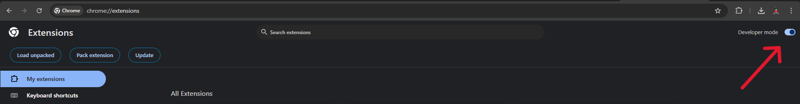
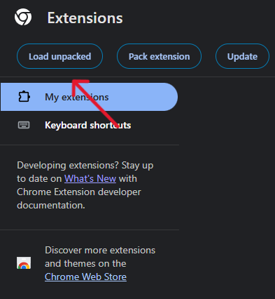
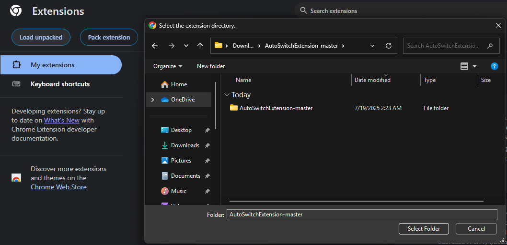
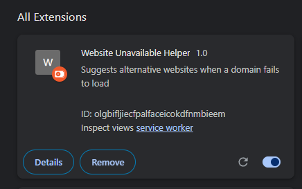

# Website Unavailable Helper (AutoSwitchExtension)

Suggests alternative websites when a domain fails to load. Useful for quickly finding alternatives or checking if a site is down.

## Features

- Detects when a website fails to load
- Suggests alternative sites (e.g., web archive, Google search, similar services)
- Easy-to-use popup UI

## Installation

### 1. Download the Extension

- [Download ZIP of this repository](https://github.com/RamyaGururaj/AutoSwitchExtension/archive/refs/heads/master.zip) 

### 2. Extract the ZIP File

- Unzip the downloaded file to a folder on your computer.

### 3. Install in Chrome

1. Go to `chrome://extensions/`

2. Enable **Developer mode** (top right)

   

3. Click **Load unpacked**

   

4. Select the folder where you extracted this extension.

   > **Note:** The extracted folder may be inside another folder (e.g., `AutoSwitchExtension-master/AutoSwitchExtension/`). Make sure to select the **inner folder** that contains the `manifest.json` file. If you select the wrong folder, you may see an error like "Manifest file is missing or unreadable."

   

The extension will now appear in your browser.

## Contributing

Pull requests are welcome! For major changes, please open an issue first to discuss what you would like to change.
